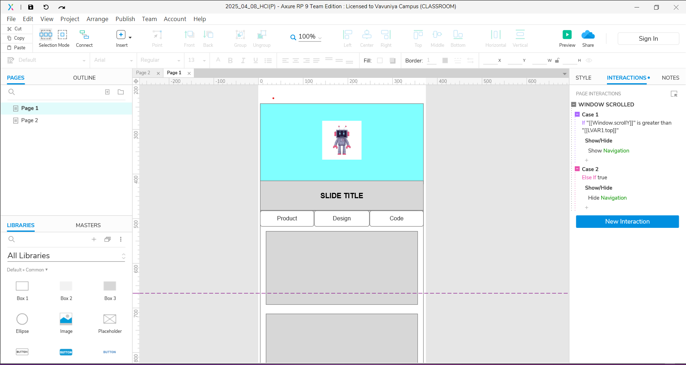
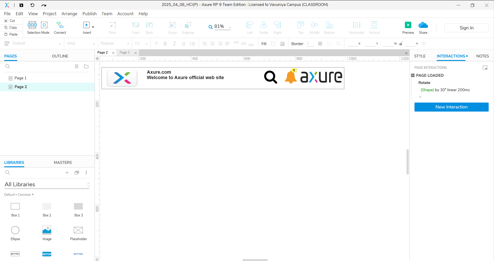
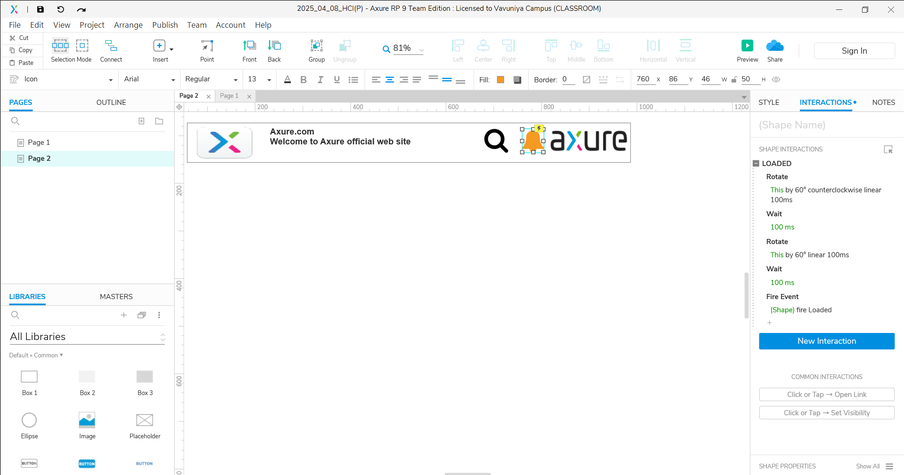

# Sticky Navigation Bar and Rotating Bell – Axure RP 9

This project is a UI prototype built using **Axure RP 9**, featuring:

- A **sticky (fixed) navigation bar** that remains visible during page scroll
- A **rotating bell icon** with interactive animation (for notifications)

Designed using Axure’s event-driven logic and animation tools, this prototype demonstrates how dynamic and interactive UI elements can be created without writing a single line of code.

---

## ✨ Features

### 📌 Sticky Navigation Bar
- Always stays at the top of the page while scrolling
- Smooth layout and stylish design
- Ideal for websites and web apps that require persistent access to menus or actions

### 🔔 Rotating Bell Icon
- Rotates on **hover** or **click**
- Created using Axure's **Rotate** interaction
- Can simulate real-time notifications visually

---

## 🧰 Tools Used

- **Axure RP 9** – For wireframing, prototyping, and animations

---

---

## 📸 Preview Screenshot

---

## 👨‍🎨 Author

**Dinuki Prarthana**  
🔗 [ GitHub](https://github.com/Dinuki85)  

---

## 📄 License

This prototype is created for educational/demo use. Feel free to use or customize it for your own design purposes.

